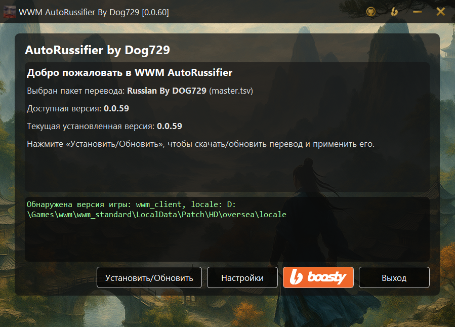
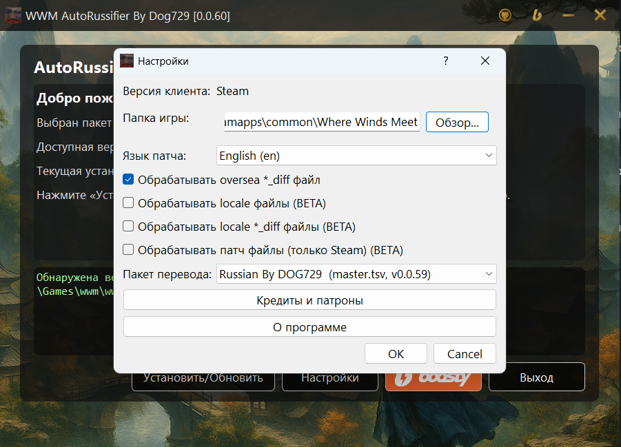

[Авто-Патчер (авто-установка)](#авто-патчер-autorussifier) | [FAQ](#faq) | [Все возможные проблемы](#все-возможные-проблемы) | [Неполный перевод](#неполный-перевод)

### Важно

**Перед тем как что‑либо устанавливать, хотя бы один раз зайдите в игру, чтобы она создала все необходимые временные файлы.**

# Авто-Патчер AutoRussifier

Steam | клиент разработчиков | китайский клиент | Epic Games (поддержка в разработке)

### Что он делает
1. Русифицирует выбранную локализацию из настроек (патчит выбранный язык).
2. Обновляет перевод до последней доступной версии (по нажатию кнопки).
3. Позволяет менять версию локализации.
4. Продолжает корректно работать после обновления игры.

### Возможности и настройки

1. Можно указать папку, в которой установлена игра.
2. Можно выбрать язык, который будет пропатчен. Если вы хотите оставить английский язык, патчер этому не мешает.
3. Обработать файл `oversea_diff` (+ ~15k строк перевода).
4. Обработать основной файл `locale` (+ ~30k строк перевода, BETA).
5. Обработать основной файл `locale_diff` (+ ~30k строк перевода, BETA).
6. Обработать патч‑файл для Steam (+ ~13k строк перевода, BETA).
7. Выбрать пакет перевода.

Информация о количестве дополнительных строк перевода примерная: она может зависеть от версии игры, типа клиента и других факторов.

# FAQ

- **Вопрос:** Зачем нужен AutoRussifier?
 
  **Ответ:** AutoRussifier позволяет быстро обновить и установить новый перевод. Он даёт возможность играть с переводом сразу после обновления игры, не дожидаясь выхода обновлённой версии перевода. При ручной установке старого перевода через замену файла возможны вылеты и появление китайских символов в игре. В случае использования патчера, если вы, например, накатываете перевод на английскую версию, у вас просто появятся новые английские слова (без «кракозябр»).

# Все возможные проблемы

- **Запрос:** Ничего не установилось – игра вылетает. Help me.
 
  **Ответ:** Сделайте проверку целостности файлов игры в клиенте. Запустите игру, дождитесь загрузки аккаунта, затем выйдите и повторите попытку установки.

- **Запрос:** У меня Steam-версия, а перевод неполный, очень много строк без перевода.
  
  **Ответ:** Читаем раздел [«Неполный перевод»](#неполный-перевод).

- **Запрос:** У меня клиентская версия, и даже не переведено [Inner Way].
  
  **Ответ:** Убедитесь, что вы поставили две галочки в настройках. Если да, но это не помогло, напишите на почту admin@dog729.ru, приложив `error.log` (если он есть; файл находится в папке `path_auto_updater`) и указав свой Telegram для связи.

- **Запрос:** Игра уходит в «реанимацию» (восстановление файлов).
  
  **Ответ:** Сделайте проверку целостности игры или ещё раз нажмите «Восстановить игру» через клиент. После этого снова зайдите в игру, выйдите и попробуйте накатить обновление. В случае неудачи уберите все галочки `Beta` в AutoRussifier.

- **Запрос:** Ошибка (13) Permission denied.
  
  **Ответ:** Эта ошибка возникает, когда у AutoRussifier нет доступа либо к клиенту игры, либо к файлам игры.
  1. Попробуйте запустить AutoRussifier от имени администратора.
  2. Если игра находится в Program Files, перенесите её в другую папку. Чаще всего у AutoRussifier нет доступа к изменениям в Program Files.

- **Запрос:** Ошибка TimeOut

  **Ответ:** По какой-то причине у вас нет доступа к скачиванию файла с GitHub. Вы можете попробовать позже. Также убедитесь, что у вас не подключены *прокси*, *маскировщики DPI* и т.д., которые могли бы нарушить состояние сети.

# Неполный перевод
Решение от 01.12.2025 (может перестать работать)

Индикатором того, что вы теряете примерно 10–30 % перевода, является вкладка, показанная на этом скриншоте (актуально на 07.12.2025):

В случае отсутствия перевода подробнее прочитайте [этот пост на Бусти](https://boosty.to/dog729/posts/5dc26820-adf7-4f2d-931b-f8dea6bddf5c).